# OPL Information

## Common

### Environment

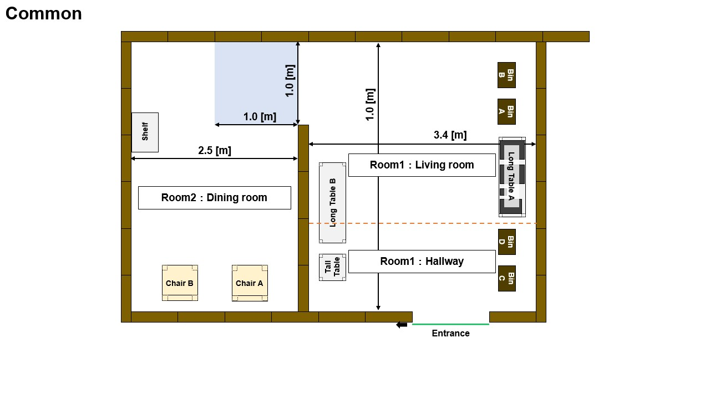
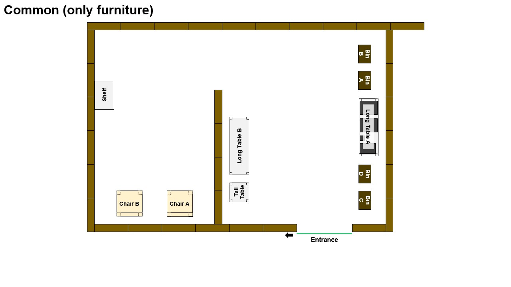 
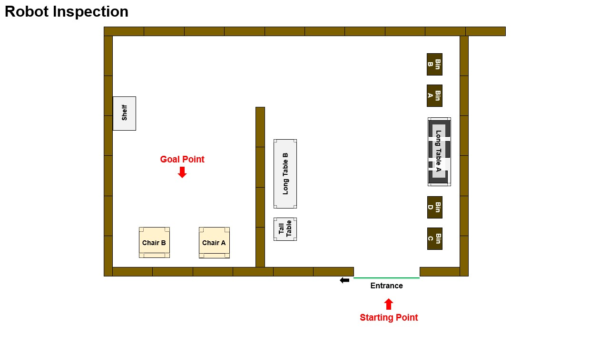
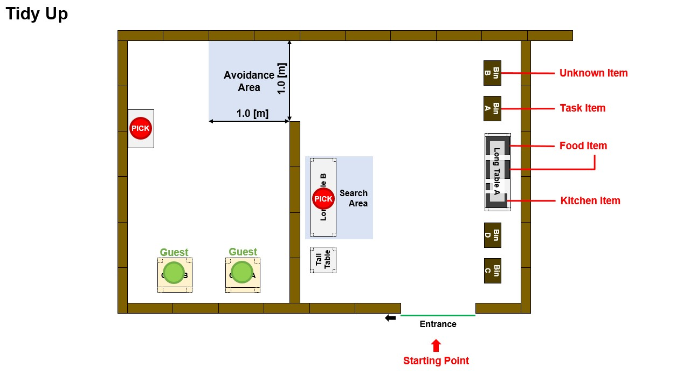
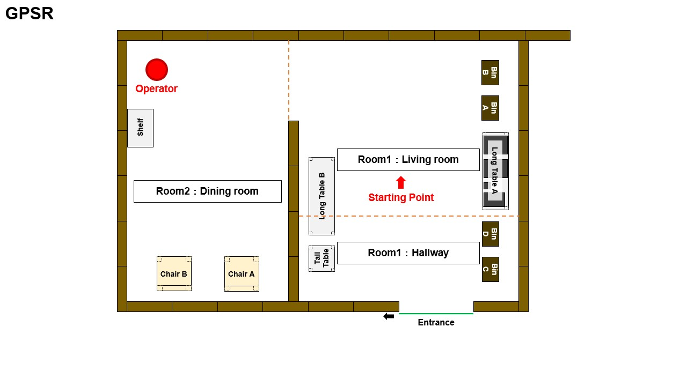
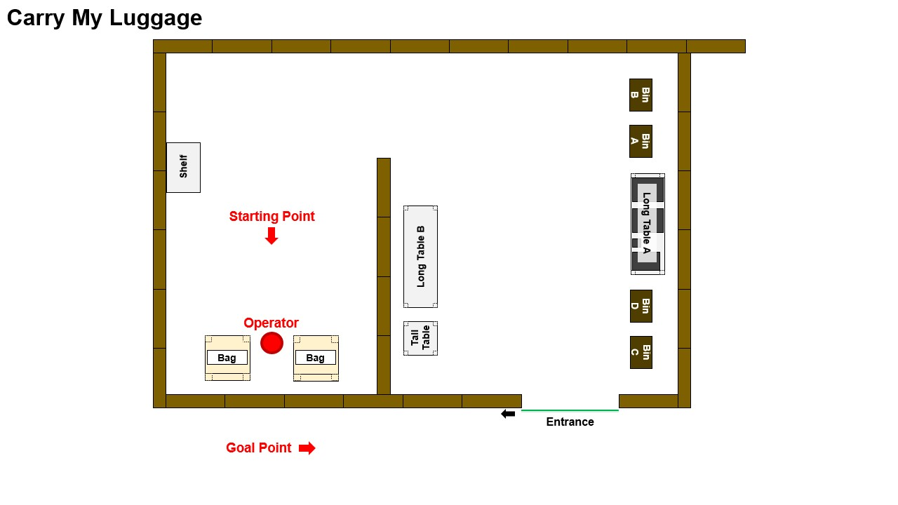
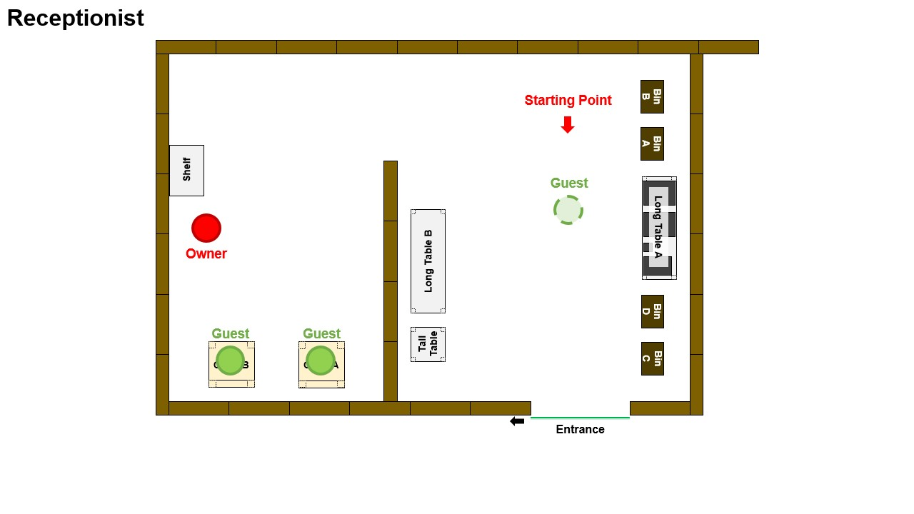

## Carry My Luggage
Bag to be used will be [the same as in RCJ 2022]().

## Receptionist

### Drink List

| #   | Drink name  |
| --- | ----------- |
| 1   | Coke        |
| 2   | Milk        |
| 3   | Green tea   |
| 4   | Apple juice |
| 5   | Coffee      |
| 6   | Beer        |

### Name List

The [same name list used for GPSR](#names) will be used for the Receptionist task.

## Tidy Up

## Object List

### [Known] Standard Object List

The same [object list used in the RCAP 2021](https://github.com/RoboCupAtHomeJP/AtHome2021/blob/master/Data/opl_known_object_list.pdf) is used as pre-announced known objects.

### [Known] Consistent Object List

| Picture | 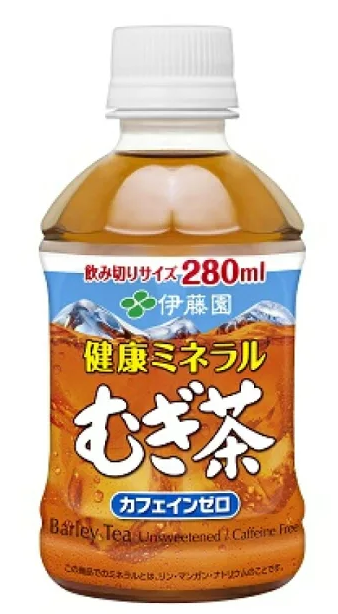 | 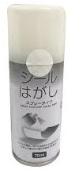 | 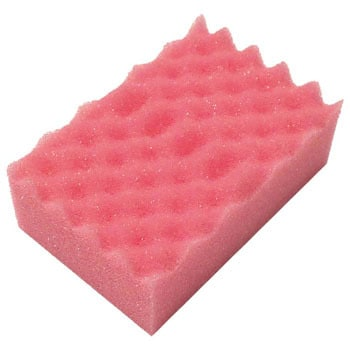 |
| ------------ | ------------ | ----------- | ----------- |
| Item Name    | Barley Tea | Label Remover | Pink Sponge |
| Object Class | Food Item | Task Item | Kitchen Item |

> **Note**
> 1 iteam will be given to each team.

> **Warning**
> The `Barley Tea` object will be empty.
> The stick from the  `Label Remover` will not be taken off.
> The `Pink Sponge` item will be used without the plastic wrap. 

### Dummy Object

| Picture | 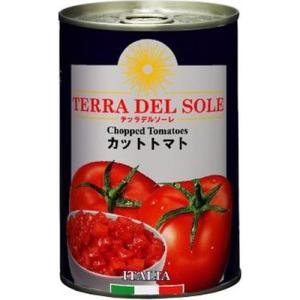 |
| ------------ | ------------ |
| Item Name    | Tomato Can |
| Object Class | Dummy Object |

> **Note**
> 3 dummy objects will be placed in the avoidance area during the Tidy Up task.
> No dummy objects will be distributed to each team. Please use it only the practice time.

### Unknown Object

The object to be used will be one not listed above and will not be previously announced.

## GPSR
### Predefined Locations for Categories

| Object Class | Location     | Room        |
| ------------ | ------------ | ----------- |
| Food         | Shelf        | Dining room |
| Kitchen      | Long table B | Living room |
| Task         | Tall table   | Hallway     |

### Questions

| #   | Question                                                 | Answer                                      |
| --- | -------------------------------------------------------- | ------------------------------------------- |
| 1   | What is the highest mountain in Japan?                   | It is Mt. Fuji.                             |
| 2   | What is the largest lake in Japan?                       | It is Lake Biwa.                            |
| 3   | Where are you coming from?                               | We are coming from `your_country`.          |
| 4   | Are you enjoying this competition?                       | Yes, we are enjoying it a lot.              |
| 5   | What is your favorite drink?                             | My favorite drink is `favorite_drink_name`. |
| 6   | How are you today?                                       | I am feeling `emotion`.                     |
| 7   | Do Thai people ride an elephant to go to the university? | No, they ride a dinosaur.                   |
| 8   | Can you tell me which country won the WBC this year?     | Japan.                                      |
| 9   | Can you tell me how many joints your robot arm has?"     | It has `num_of_arms`.                       |
| 10  | What is 3 times 5?                                       | It is 15.                                   |

### Postures

| #   | Posture                         |
| --- | ------------------------------- |
| 1   | Standing                        |
| 2   | Raising one hand                |
| 3   | Waving both hands over head     |
| 4   | Performing the thumbs-up symbol |
| 5   | Sitting on a chair              |

### Names

> **Note**
> The same [name list as RoboCup 2019](https://github.com/RoboCupAtHome/Sydney2019/blob/master/Files/Names.pdf) is used.

| Female Names | Male Names |
| ------------ | ---------- |
| Amelia       | Angel      |
| Angel        | Charlie    |
| Ava          | Hunter     |
| Charlie      | Jack       |
| Charlotte    | Max        |
| Hunter       | Noah       |
| Max          | Oliver     |
| Mia          | Parker     |
| Olivia       | Sam        |
| Parker       | Thomas     |
| Sam          | William    |

### Command Generator

[Modified version of the GPSR command generator](https://github.com/akinobu1998/GPSRCmdGen/tree/rcj-opl2023) is used. Please check [the latest release](https://github.com/akinobu1998/GPSRCmdGen/releases).
