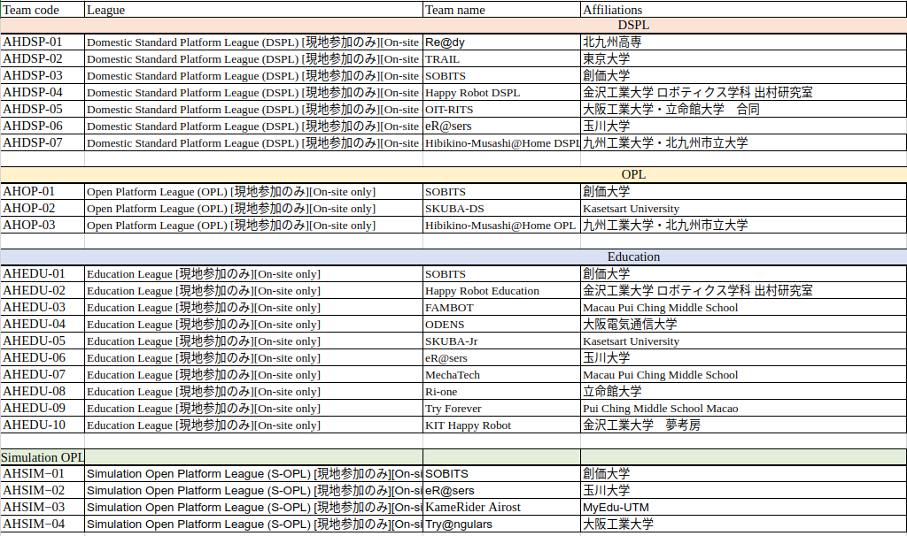

# RoboCup Japan Open 2023 @Home League

本リポジトリは大会参加者向けの各種情報を発信するためのリポジトリです．[こちらの@Homeリーグ公式サイト](https://sites.google.com/site/robocuphomejapan/home)もご覧ください．

## 大会概要
大会情報等，順次更新していきます．大会概要について，まずは以下の日本委員会のサイトをご参照ください．
- [ロボカップ日本委員会サイト](https://www.robocup.or.jp/japanopen2023/overview.html)

## スケジュール / Schedule

### 会場
[滋賀ダイハツアリーナ](https://shiga-arena.jp), [MAP](https://goo.gl/maps/sTLdyA72JWa7g67s9)

## 参加方法 (REGISTRATION)
手順は以下の通りです．

1. **Pre registration** @Homeリーグ実行委員が用意する[仮登録フォーム](https://docs.google.com/forms/d/e/1FAIpQLSchOq-ZFpDM4_SGi-v-VwI93-Mz1-hiSW0qeE3oUSAUC6o26g/viewform)に申請する（本登録で必要なチームコードが発行されます）
2. **Registration** [ロボカップ事務局の登録フォーム](https://www.robocup.or.jp/japanopen2023/registration.html)で本登録を行う
3. **Payment** 参加費支払い

### 締切 (IMPORTANT DAYS)
- 仮登録締切 (Pre registration): 2023/03/31, 13:00 JST
- 本登録締切 (Registration): 2023/03/31
- 参加費支払い締切 (Payment): 2023/04/07

## 参加チーム (Participants)

## OPL
[OPLの事前公開リスト・マップ等の情報一覧](./OPL/README.md)

### スコア (Score)

#### 採点表 (Score Sheet)

各タスクの詳細なスコアを確認できるように，[採点表](https://docs.google.com/spreadsheets/d/1gMZPzfHsSJDjRlE8-j3S--jwaql_sCJq/edit#gid=855097569)をご確認ください．

Please chech the [score sheet](https://docs.google.com/spreadsheets/d/1gMZPzfHsSJDjRlE8-j3S--jwaql_sCJq/edit#gid=855097569) if you want to know in detail the achieved points for each task.

## DSPL
[DSPLの事前公開リスト・マップ等の情報一覧とスコア](./DSPL/README.md)

アリーナWiFiを利用されるチーム（DSPL）は以下のフォームからWi-Fiに接続するすべての機器のMACアドレスを申請してください．
[DSPLアリーナWiFiMACアドレス申請フォーム](https://forms.office.com/Pages/ResponsePage.aspx?id=DQSIkWdsW0yxEjajBLZtrQAAAAAAAAAAAAMAAMWXA8tURFdEN1g3SjdHTEhVMTdFNDNLWlVST1Y3Ty4u)

## Education
[スコア](./EDU/README.md)